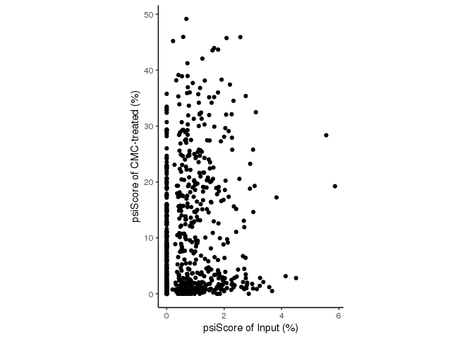
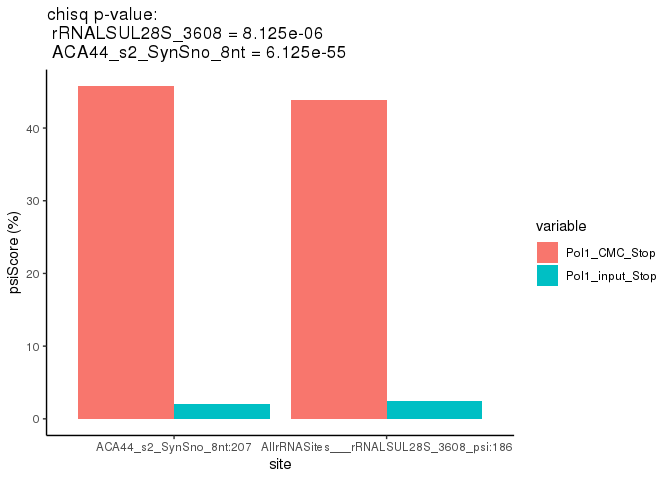

Quantification of pseudouridine at single base resolution
================

## Description of the code

This code quantifies pseudouridine levels at single base resolution. In
short, BAM files are processed by the
[bam2ReadEnds.R](https://github.com/SchwartzLab/mazter_mine) program
published as part of MAZTER-mine (Garcia Campos et al., 2019) to form an
R object named “countdata” saved as “.Rdata”.

The countdata object holds information on the number of reads starting,
ending and covering each position annotated in the BED file, used as
input for the bam2ReadEnds.R code.

The data in the countdata object is used to calculate psiScores (i.e.,
level of pseudouridylation) for each position by dividing the number of
reads beginning at the position by the overall number of reads covering
it.

The code below processes the “.Rdata” files found in the working
directory to yield a file names **data\_plots.Rdata** which holds:

1)  two dataframes containing psiScores at each position of each gene
    annotated in the BED file.
2)  two exemplary plots of the analyzed data appearing in the
    aformentioned dataframes.

The code should be run from the folder containing the input “.Rdata”
files.

## Demo data

The files “Pol1\_CMC.Rdata” and “Pol1\_input.Rdata” are to be processed
when running the code below. They represent data from CMC-treated and
Input samples, respectively. The code calculates psiSCores for each
position in each sample and conducts statistical tests (chisq test) to
identify positions significantly modified in CMC-treated versus Input
sample.

## General information

The code has been tested using R version 3.6.0. No non-standard hardware
is needed.

R can be downloaded freely and installed in less than 10 minutes on a
“normal” desktop computer.

Running the code on the demo data takes less than 1 minute and initiates
by running the code from the directory where the .Rdata files are found.

## Code

``` r
# dependencies ########################################
library(reshape2)
library(ggplot2)

# upload files ########################################
inDir=getwd()

fList = lapply(1:length(inDir), function(x){
  list.files(inDir[x], pattern=".Rdata",full.names=TRUE)
})

dfList = lapply(1:length(fList), function(f){
  f0 = lapply(1:length(fList[[f]]), function(x){
    f1 = load(fList[[f]][x])
    assign(gsub("Aligned.*|.*/","",fList[[f]][x]), countData)
  })
})

# parse data ##########################################
dfs1 = lapply(1:length(dfList), function(x){
  d1 = lapply(1:length(dfList[[x]]), function(y){
    d3 = as.data.frame(do.call(rbind,lapply(1:length(dfList[[x]][[y]]), function(z){
      d2 = as.data.frame(do.call(cbind, dfList[[x]][[y]][[z]]))
      names(d2) = c("rE5", "rE3", "cov")
      d2$Stop = d2$rE5/d2$cov
      d2$pos = c(1:nrow(d2))
      d2$gene = rep(names(dfList[[x]][[y]][z]), nrow(d2))
      d2$id = paste0(d2$gene, ":", d2$pos)
      d2
    })))
    names(d3) =  c(paste0(gsub(".*/|.Rdata","",fList[[x]])[y],"_", 
                          c("rE5", "rE3", "cov", "Stop")), "pos","gene", "id")
    d3
  })
  d4 = Reduce(function(x, y) merge(x, y, all=TRUE, by=c("id","gene","pos")), d1)
})

DF = Reduce(function(x, y) merge(x, y, all=TRUE, by=c("id","gene","pos")), dfs1) # this df has no replicated rows
DF$empty = apply(DF[,grep(".*cov", names(DF), value=T)]==0,1,all,na.rm=T)
DF$type = gsub(".*SynSno_|:.*|___.*","", DF$id)
DF$set = ifelse(grepl("SynSno", DF$id), "synsno",
                ifelse(grepl("All.*psi", DF$id), "rRNA",
                       ifelse(grepl("Chop", DF$id),"ChoppedrRNA", NA)))

DF$maxCov = apply(DF[,grep("cov", names(DF))], 1, max, na.rm=T)
DF$passCMC = DF$Pol1_CMC_cov-DF$Pol1_CMC_rE5
DF$passInput = DF$Pol1_input_cov - DF$Pol1_input_rE5

# create a dataframe holding only positions of interest #######################################

df = rbind(subset(DF, grepl("^rRNA", set) & pos==186 & !empty)[,!grepl("rE3", names(DF))],
           subset(DF, grepl("synsno", set) & pos==207 & !empty)[,!grepl("rE3", names(DF))])

# add statistics ##############################################################################
df$chisq = unlist(lapply(1:nrow(df), function(x){
  m = matrix(c(df[x,grep("CMC.*rE5", names(df))],
               df[x,grep("passCMC", names(df))],
               df[x,grep("input.*rE5", names(df))],
               df[x,grep("passInput", names(df))]),
             byrow=TRUE, 2, 2)
  tryCatch({signif(chisq.test(m)$p.value, 4)}, error=function(e) {return(NA)})
}))

# parse dataframe for plotting ################################################################
df.melt = melt(df[,grep("id|Stop|chisq", names(df))], id=c("id", "chisq"))

# plots ####################################################################################### 
p1 = ggplot(subset(df, maxCov>100),
            aes(x= Pol1_input_Stop*100, y=Pol1_CMC_Stop*100))+
  geom_point()+theme_classic()+
  coord_fixed(ratio=max(df$Pol1_input_Stop, na.rm=T)/max(df$Pol1_CMC_Stop, na.rm=T))+
  xlab("psiScore of Input (%)")+ylab("psiScore of CMC-treated (%)")

p2 = ggplot(subset(df.melt, id %in% c("AllrRNASites___rRNALSUL28S_3608_psi:186",
                                      "ACA44_s2_SynSno_8nt:207")),
            aes(x= id, y=value*100, fill=variable))+
  geom_bar(stat="identity", position="dodge")+theme_classic()+
  xlab("site")+ylab("psiScore (%)")+
  ggtitle(paste0("chisq p-value: \n rRNALSUL28S_3608 = ",
                 unique(df.melt[df.melt$id=="AllrRNASites___rRNALSUL28S_3608_psi:186","chisq"]),
                 "\n ACA44_s2_SynSno_8nt = ",
                 unique(df.melt[df.melt$id=="ACA44_s2_SynSno_8nt:207","chisq"])))

save(df, df.melt, p1, p2, file=file.path(inDir,"data_plots.Rdata"))
```

## Plots

Comparison of psiScore of all variants in the transfected library in a
CMC-treated versus an Input sample:

<!-- --> <br><br><br>
Comparison of two specific sites (one in a synthetic construct and one
in a native rRNA fragment) from the transfected library in a CMC-treated
versus an Input sample:

<!-- -->

## Code references

MAZTER-mine (Garcia-Campos et al., 2019)
[DOI:\[10.5281/zenodo.3581426\](https://zenodo.org/badge/latestdoi/178392100)](DOI:%5B10.5281/zenodo.3581426%5D\(https://zenodo.org/badge/latestdoi/178392100\))

## Session information

Technical information of the system were this code was run.

``` r
sessionInfo()
```

    ## R version 3.6.0 (2019-04-26)
    ## Platform: x86_64-pc-linux-gnu (64-bit)
    ## Running under: CentOS Linux 7 (Core)
    ## 
    ## Matrix products: default
    ## BLAS:   /apps/RH7U2/gnu/R/3.6.0_2020/lib64/R/lib/libblas.so.3
    ## LAPACK: /apps/RH7U2/gnu/R/3.6.0_2020/lib64/R/lib/libRlapack.so
    ## 
    ## locale:
    ##  [1] LC_CTYPE=en_US.UTF-8       LC_NUMERIC=C              
    ##  [3] LC_TIME=en_US.UTF-8        LC_COLLATE=en_US.UTF-8    
    ##  [5] LC_MONETARY=en_US.UTF-8    LC_MESSAGES=en_US.UTF-8   
    ##  [7] LC_PAPER=en_US.UTF-8       LC_NAME=C                 
    ##  [9] LC_ADDRESS=C               LC_TELEPHONE=C            
    ## [11] LC_MEASUREMENT=en_US.UTF-8 LC_IDENTIFICATION=C       
    ## 
    ## attached base packages:
    ## [1] stats     graphics  grDevices utils     datasets  methods   base     
    ## 
    ## other attached packages:
    ## [1] ggplot2_3.3.2  reshape2_1.4.4
    ## 
    ## loaded via a namespace (and not attached):
    ##  [1] Rcpp_1.0.4.6     knitr_1.28       magrittr_1.5     tidyselect_1.1.0
    ##  [5] munsell_0.5.0    colorspace_1.4-1 R6_2.4.1         rlang_0.4.7     
    ##  [9] dplyr_1.0.0      stringr_1.4.0    plyr_1.8.6       tools_3.6.0     
    ## [13] grid_3.6.0       gtable_0.3.0     xfun_0.15        withr_2.2.0     
    ## [17] htmltools_0.5.0  ellipsis_0.3.1   yaml_2.2.1       digest_0.6.25   
    ## [21] tibble_3.0.3     lifecycle_0.2.0  crayon_1.3.4     farver_2.0.3    
    ## [25] purrr_0.3.4      vctrs_0.3.1      glue_1.4.1       evaluate_0.14   
    ## [29] rmarkdown_2.3    labeling_0.3     stringi_1.4.6    compiler_3.6.0  
    ## [33] pillar_1.4.6     generics_0.0.2   scales_1.1.1     pkgconfig_2.0.3
